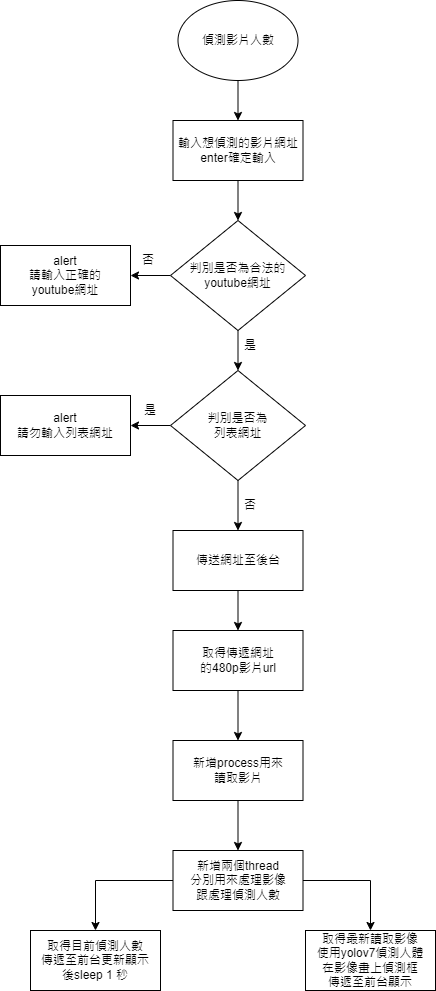

# Frontend
目前這專案，是用來練習前後台撰寫。
用途是偵測影片中的人數
現在主要是偵測youtube上的即時影片串流

## How to run
npm install
npm run servec

## 目前功能流程圖

### 偵測影片人數
目前會將socketio的emit設定都在MainPage.vue mounted時設定好。
目前設定功能有:
  1. receive_image : 取得後台傳來處理好的圖片並且更新
  2. receive_detect_number : 取得後台傳來的偵測人數並更新
### 輸入想偵測的影片網址enter確定輸入
透過enter確認輸入的youtube網址，會再將網址送入setYoutubeUrl()確認是否符合需求格式

### 判別是否為合法的youtube網址
若不是youtube網址會造成後台錯誤，故在此設立防呆
使用正規表達式確認
### alert 請輸入正確的youtube網址
跳出警告提醒使用者重新輸入
### 判別是否為列表網址
由於目前後台是使用yt-dlp套件，若是輸入的是影片列表網址會一次讀取該列表所有影片，進而發生錯誤
### 傳送網址至後台
確認皆無誤後，傳送網址到後台開始讀取影片。
目前為了傳送不會延遲，後台是設定讀取影片480p畫質，但尚未設定防呆

## 預計新增功能
1. 人數到達一定時，將當下的圖片以及人數透過telegram bot傳遞告知使用者
2. 將人流趨勢以圖片呈現
3. 新增其他影片來源

## Reference
https://github.com/WongKinYiu/yolov7
https://github.com/yt-dlp/yt-dlp/
https://www.kaggle.com/code/parapapapam/yolov7-quick-start